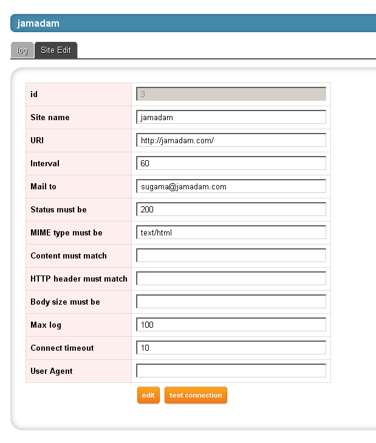

MojoDownMonitor 0.01 ALPHA
---------------

## DESCRIPTION

This is a web monitoring tool to detect your sites down.

MojoDownMonitor gets multiple URIs in regular basis and checks if the response
fulfills given conditions. 

## INSTALLATION

To install this module, run the following commands:

    $ perl Makefile.PL
    $ make
    $ make test
    $ make install

## GETTING STARTED

    $ hypnotoad ./mojo-down-monitor
    Server available at http://127.0.0.1:8010.

    $ hypnotoad ./mojo-down-monitor --stop

Copyright (c) 2011 [jamadam](http://blog2.jamadam.com)

Dual licensed under the MIT and GPL licenses:

- [MIT Licence](http://www.opensource.org/licenses/mit-license.php)
- [GPL v1](http://www.gnu.org/licenses/gpl.html)
